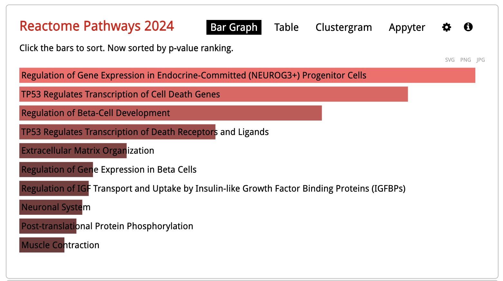
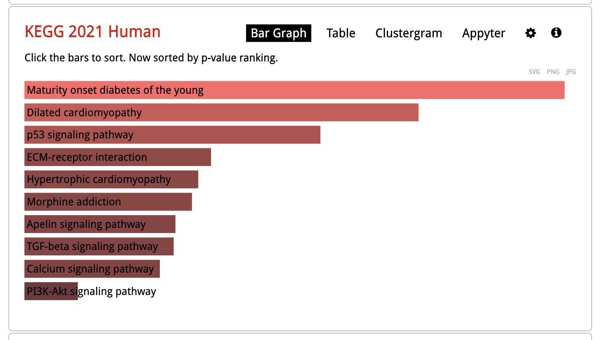

## Project 2 Notebook -- RNA-seq experiment

# Commenting on MultiQC results:
Looking through the MultiQC report shows that the experiment can be considered successful and that the data can be used in later analysis. First, the report shows that there was a high level of alignment. In this data set, there is about a 95% alignment, which when compared to the general standard of about 70% is a good sign. Second, the GC content is reported to be around 49%. When plotted, this data resembles a normal distribution, giving more support to the data being of good quality. This data can also be trusted due to the fact that the depth of reads for this RNA-seq experiment sits around 100 million. Further, looking at the quality score graph shows that the Phred score of each of the reads sits at above 30. The only portion of this data that could be considered as concerning is the amount of duplication, which is reported to be around 75%. However, as the over represented sequences are not a significant portion of the reads along with the topics mentioned above, the data can still be considered to be of high quality and used for downstream analysis. 

## DE Analysis -- 

```{r 1, echo=TRUE}
library(DESeq2)
library(tidyverse)
library("fgsea")
library("ggrepel")
library("RColorBrewer")
library("pheatmap")
library("ggplot2")
```
# make my count matrix, before filtering:
```{r 2, echo=TRUE}
counts <- as.matrix(read.csv("results/verse_concat.csv", row.names='gene'))
counts
```

# Here is where I filter my reads:
I am choosing the strategy of filtering the genes to require a minimum average number of counts. I removed anything that had less than 20 counts to remove the rows that had no reads or next to no reads. This brings the amount of genes from 63241 to 19319. Running the below block will create a table that can be compared against the one above to help visualize this reduction.
```{r 3, echo=TRUE}
filtered_counts <- counts[rowSums(counts >= 20) > 0, ]
filtered_counts
```

#creating colData:
```{r 4, echo=TRUE}
coldata <- read.csv("coldata.csv")
coldata
```
# des-seq:
```{r 5, echo=TRUE}
dds <- DESeqDataSetFromMatrix(countData = filtered_counts,
                              colData = coldata,
                              design = ~ condition)
dds <- DESeq(dds)
res <- results(dds, contrast=c("condition","experimental","control"))
resOrdered <- res[order(res$pvalue),]
resOrdered
```

#Add on the gene symbol to the results:
```{r 6, echo=TRUE}

results <- resOrdered %>% as_tibble(rownames='gene')
map <- read_delim('results/id2name.txt', col_names= c('id', 'symbol'))
results <- results %>% left_join(map, by=join_by(gene == id))

results
```

# Making the table for the top 10 most significant genes ranked by padj
Below is a table that presents the top 10 significant genes as ranked by padj. It has the gene names and its corresponding symbol.
```{r 7, echo=TRUE}
top10genes <- results %>% 
  slice_head(n = 10) %>%
  select(symbol, gene, pvalue, padj, baseMean, log2FoldChange)

top10genes

```


# Choosing a padj threshold and reporting the number of significant genes at this threshold
With a padj value of 0.001, below is a table that shows the number of significant genes that satisfy this threshold. With this threshold, there are about 430 genes remaining. When compared with a 0.05 padj value, there would be 1,249 genes remaining. Therefore I chose the more stricter padj value to better complete the ENRICHR analysis.

```{r 8, echo=TRUE}
sig_results <- results %>% filter(padj < 0.001) %>% arrange(padj)
sig_results
```

#ENRICHR analysis
```{r 9, echo=TRUE}
#this is to save the values to a .txt file to upload
gene_list <- sig_results %>% 
  filter(!is.na(symbol)) %>%
  pull(symbol)

writeLines(gene_list, "results/genes_for_enrichr.txt")
```


# Remarks and photos:
```{r, fig.cap="Reactome Pathways 2024", out.width="80%", fig.align="center"}

```

```{r, fig.cap="KEGG 2021 Human", out.width="80%", fig.align="center"}

```

Doing the ENRICHR analysis on this gene set gave some interesting results. The results suggest that many of these genes are used in cellular pathways that are related to endocrine function. For example, the reactome pathways 2024 shows a strong enrichment of genes for the regulation of gene expression in endocrine-committed progenitor cells and in beta-cell development. It also has implications in cell death pathways, as shown by the enrichment of TP53 cell death pathways. These observations can also be found in the KEGG pathways through the gene enrichment of p53 signalling pathways and of maturity onset of diabetes of young individuals. Combined, these observations support that these sets of genes play a role in endocrine related functions.


##RNAseq Quality Control Plots

#Choosing a normalization strategy and generating a normalized counts matrix:
```{r 12, echo=TRUE}
vsd <- vst(dds, blind=TRUE)
plotPCA(vsd, intgroup="condition")
```

NOTE!!: for some reason, knitting this file to an html is changing the graphs I made! I am assuming that you are reading this on the html file so below this text is what the graph I made and wrote about looks like in the r markdown file! I don't know what is happening or why things are changing 


# Heatmap of sample-to-sample distances
```{r 13, echo=TRUE}

samplesDists <- dist(t(assay(vsd)))

sampleDistMatrix <- as.matrix(samplesDists)
rownames(sampleDistMatrix) <- paste(vsd$condition, vsd$type, sep="-")
colnames(sampleDistMatrix) <- NULL
colors <- colorRampPalette( rev(brewer.pal(9, "Oranges")))(255)

pheatmap(sampleDistMatrix,
         clustering_distance_rows=samplesDists,
         clustering_distance_cols=samplesDists,
         col=colors)
```

# My interpretations and comments of the two plots:
  The PCA plot displays a strong separation between both the experimental and control samples. This supports the idea that this experiment was able to uncover a strong biological effect where the gene knockouts contributed to the change in gene expression that helps to aid the variance. There is one experimental sample that can be considered an outlier. However, this sample also is quite separate from the control samples, supporting the above argument. Additionally, the samples in both conditions seem to be rather tightly clustered together. This clustering supports the idea that there was little variability between the samples. The graph also displays that the variance of PC1 is 86% while the variance of PC2 is 10%. This means that 96% of the variance was captured in this experiment and that 86% of the variance can be attributed to the biological question at hand. These scores further support the idea that the experiment was successful and that the knockout completed is the main source of change in the gene expression.
  A sample-to-sample distance heatmap was also generated on the same data and supports the same findings as the PCA plot did. First, there are two separate groupings on the opposite sides of the plot that can be seen through the color intensity in the heat map that is similar to the clustering in the PCA plot. Additionally, this observed  pattern of intensity in both of these groups suggests that there is high similarity between the samples that sit within these two respective groups. Lastly, the dendrograms recorded on the top and left side of the heatmap support the idea that the one experimental outlier is more closely related to the experimental group than the control group. Combined, these observations convey the idea that the experiment was successful and gives confidence that the results are due to the knockout event.

  


## FGSEA Analysis:

```{r 14, echo=TRUE}
rnks <- results %>% 
  arrange(desc(log2FoldChange)) %>% 
  drop_na(log2FoldChange) %>% 
  distinct(symbol, .keep_all = TRUE) %>% 
  pull(log2FoldChange, symbol)

c2 <- fgsea::gmtPathways('c2.all.v2025.1.Hs.symbols.gmt')

fgsea_results <- fgsea(
  pathways = c2, 
  stats = rnks, 
  )

fgsea_results <- fgsea_results %>% as_tibble()

head(fgsea_results)

```

#Brief remarks on the results and something biologically interesting:
  The results from the FGSEA show 4 different gene sets that are connected to LIF, which are Leukemia Inhibitory Factors. Additionally, two other gene sets related to cancer also were identified. These findings are biologically interesting due to the fact that these gene sets have implications in endocrine regulation and hormone signalling, like the genes put through this analysis, despite also being associated with cancer.


## Recreating Figures from the paper: 

#3c: volcano plot 
```{r 15, echo=TRUE}
library(dplyr)

padj_threshold <- 0.001
fc_threshold <- 1  

results_plot <- results %>%
  mutate(
    significance = case_when(
      padj < padj_threshold & log2FoldChange > fc_threshold ~ "UP",
      padj < padj_threshold & log2FoldChange < -fc_threshold ~ "DOWN",
      TRUE ~ "NS"
    )
  )

top_up <- results_plot %>%
  filter(significance == "UP") %>%
  arrange(padj) %>%
  slice_head(n = 10)

top_down <- results_plot %>%
  filter(significance == "DOWN") %>%
  arrange(padj) %>%
  slice_head(n = 10)

genes_to_label <- bind_rows(top_up, top_down)

ggplot(results_plot, aes(x = log2FoldChange, y = -log10(padj))) +
  geom_point(aes(color = significance), alpha = 0.6, size = 1.2) +
  scale_color_manual(
    values = c("UP" = "#FF6B6B", "DOWN" = "#4ECDC4", "NS" = "grey50"),
    labels = c("UP" = "UP", "DOWN" = "DOWN", "NS" = "Not Significant")
  ) +
  geom_text_repel(
    data = genes_to_label,
    aes(label = symbol),
    size = 3.5,
    max.overlaps = 30,
    box.padding = 0.5,
    point.padding = 0.3,
    segment.color = "grey50",
    segment.size = 0.3,
    min.segment.length = 0
  ) +
  geom_vline(xintercept = c(-fc_threshold, fc_threshold), 
             linetype = "dashed", 
             color = "grey30",
             size = 0.5) +
  geom_hline(yintercept = -log10(padj_threshold), 
             linetype = "dashed", 
             color = "grey30",
             size = 0.5) +
  labs(
    x = expression(Expression~difference~(log[2]*FC)),
    y = expression(Significance~(-log[10]~p~value)),
    color = ""
  ) +
  theme_classic(base_size = 12) +
  theme(
    legend.position = "top",
    legend.justification = "center",
    panel.grid.major = element_blank(),
    panel.grid.minor = element_blank(),
    axis.line = element_line(color = "black", size = 0.5)
  ) +
  annotate("text", x = -7, y = max(-log10(results_plot$padj), na.rm = TRUE) * 0.95,
           label = "DOWN", color = "#4ECDC4", size = 5, fontface = "bold") +
  annotate("text", x = 7, y = max(-log10(results_plot$padj), na.rm = TRUE) * 0.95,
           label = "UP", color = "#FF6B6B", size = 5, fontface = "bold")
```

#3f: 
```{r 16, echo=TRUE}
top_pos <- fgsea_results %>% slice_max(NES, n=10) %>% pull(pathway)
top_neg <- fgsea_results %>% slice_min(NES, n=10) %>% pull(pathway)

subset <- fgsea_results %>%
  filter(pathway %in% c(top_pos, top_neg)) %>%
  mutate(pathway = factor(pathway)) %>%
  mutate(plot_name = str_replace_all(pathway, '_', ' '))

subset %>%
  mutate(plot_name = forcats::fct_reorder(factor(plot_name), NES)) %>%
  ggplot() +
  geom_bar(aes(x=plot_name, y=NES, fill = NES > 0), stat = 'identity', how.legend = FALSE) + scale_fill_manual(values = c('TRUE' = 'red', 'FALSE' = 'blue')) +
  theme_minimal(base_size = 8) +
  ggtitle('fgsea results for Hallmark MSigDB gene sets') + 
  ylab('Normalized Enrichment Score (NES)') +
  xlab(' ') +
  scale_x_discrete(labels = function(x) str_wrap(x, width = 80)) +
  coord_flip()
  
```


# Comments and observations: 
  The paper and this analysis were able to find a similar amount of significant genes as displayed on their respective volcano plots. The authors of the paper report that 17 genes were strongly up-regulated and 11 were strongly down-regulated. In this analysis, 8 genes were found to be significantly up-regulated and 10 were found to be significantly down-regulated.
  The enrichment results in this analysis and the papers analysis show additional similarities and differences. First, they both display a similar reduction in expression of NUEROG3 and with genes related to beta cell development. They also both report an increase in expression for genes related to integrin cell surface interactions. However, the dataset presented in this notebook also shows a difference in expression in genes related to p53 pathways. This difference could be due to the fact that these analyses used different gene counting methods or because they were filtered differently, which could have resulted in the removal of some genes that were kept in the other. Further, these differences could have arisen due to the fact that both analyses are using a different version of the human reference genome. 

# Methods comparision: 
  To begin, paired end reads were gathered from an RNA-sequencing experiment. These reads were put through FastQC v0.12.1 in order to assess their quality [1]. In order for faster computation in later steps, the GRCh38 human reference genome was indexed using STAR v2.7.11b [2]. Once both of these tasks were completed, the paired ends were then aligned to the GRCh38 genome assembly using the aligner in STAR v2.7.11b [3] with default parameters. An additional quality control was done using MultiQC v1.25 [4] after this alignment. Gene counts were then calculated using VERSE v0.1.5 [5] with default parameters and the primary assembly GTF. These gene counts were then combined and filtered to remove genes that had less than a count of 20 in each of the samples. The data was then normalized to perform differential expression analysis to compare the control and experimental samples using DESeq2 v1.46.0 [6] with default parameters.
  The method section from the paper reports a similar general structure with some differences. First, the authors mapped the read pairs to the same human reference genome, GRCh38, at a different version and also used the STAR aligner [7]. However, the authors generated their gene counts with featureCounts in Rsubread instead of VERSE [8]. Further, the authors utilized prcomp and a voom-function from limma to calculate the PCA while the above PCA was calculated with an embedded feature of DESeq2 [9]. Additionally, the authors used ClusterProfiler v3.18.1 and Fdrtool v1.2.17 in order to analyse for enrichment and to determine the false discovery rate against reactome pathways where this set of data utilized alternative methods, such as the ENRICHR web tool [10].

References 
[1] Andrews, S.  FastQC: A Quality Control Tool for High Throughput Sequence Data [Online]. Available online at: http://www.bioinformatics.babraham.ac.uk/projects/fastqc/
(2010).
[2] Dobin, A. et al. STAR: Ultrafast universal RNA-seq aligner. Bioinformatics 29, 15–21 (2013).
[3]Dobin, A. et al. STAR: Ultrafast universal RNA-seq aligner. Bioinformatics 29, 15–21 (2013)
[4] Ewels, Philip et al. MultiQC: summarize analysis results for multiple tools and samples in a single report. Bioinformatics 32, 19 (2016).
[5] Zhu, Qin et al. VERSE: a versatile and efficient RNA-Seq read counting tool. bioRxiv (2016).
[6] Love, M. I., Huber, W. & Anders, S. Moderated estimation of fold change and dispersion for RNA-seq data with DESeq2. Genome Biol. 15, 1–21 (2014).
[7] Chandra, V. et al. The type 1 diabetes gene TYK2 regulates β-cell development and its responses to interferon-α. Nat Commun 13, 6363 (2022).
[8] Chandra, V. et al. The type 1 diabetes gene TYK2 regulates β-cell development and its responses to interferon-α. Nat Commun 13, 6363 (2022).
[9] Chandra, V. et al. The type 1 diabetes gene TYK2 regulates β-cell development and its responses to interferon-α. Nat Commun 13, 6363 (2022).
[10] Chen, E.Y.,et al. Enrichr: interactive and collaborative HTML5 gene list enrichment analysis tool. BMC Bioinformatics, 14, 128. (2013).


